# MAROID
- Supports MIPS (Microprocessor without Interlocked Pipelined Stages) instruction set architecture (ISA)
- Executes MIPS assembly including 'add', 'sub', 'slt', 'addi', 'slti', 'lw', 'sw', 'beq', 'bne' and 'j' instructions.
#### interface,

<h2>My Interface Screens</h2>
<table>
  <tr>
    <td>
      <h4>Screen 1</h4>
      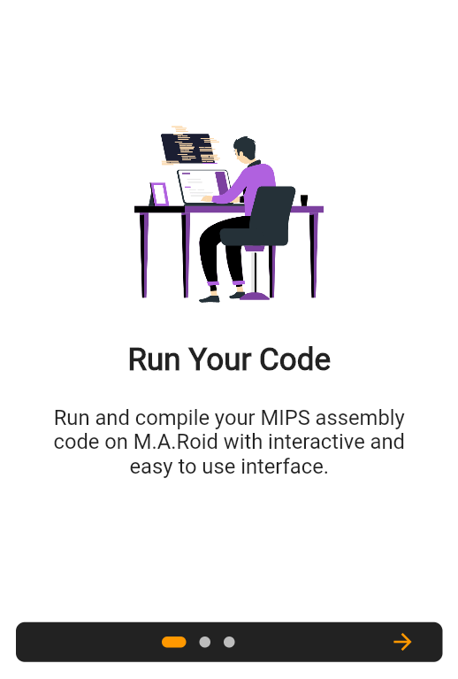
    </td>
    <td>
      <h4>Screen 2</h4>
      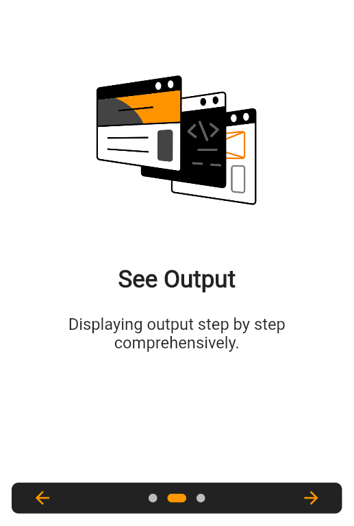
    </td>
    <td>
      <h4>Screen 3</h4>
      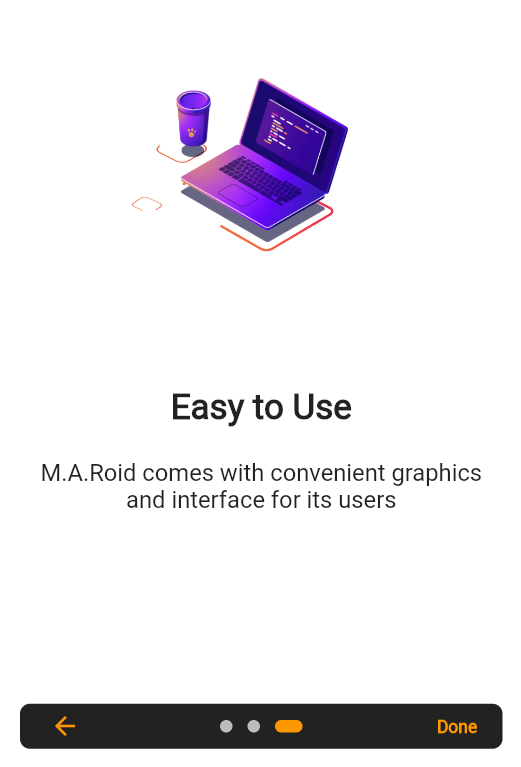
    </td>
    <td>
      <h4>Screen 4</h4>
      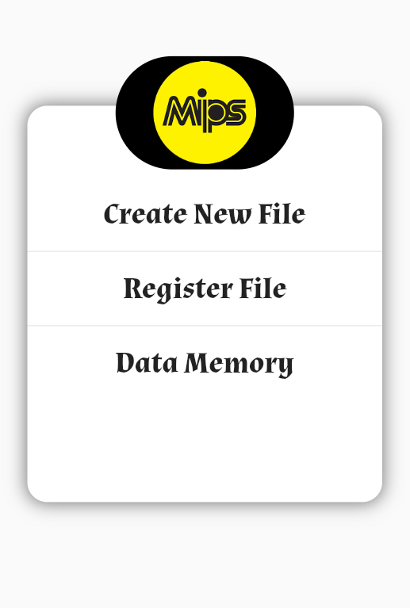
    </td>
  </tr>
</table>

<table>
  <tr>
    <td>
      <h4>Register File</h4>
      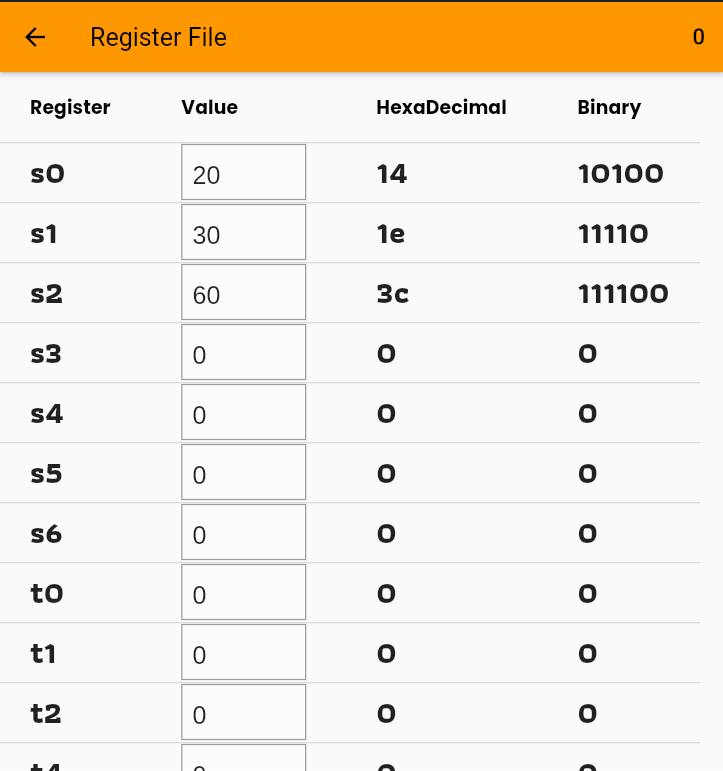
    </td>
    <td>
      <h4>Program</h4>
      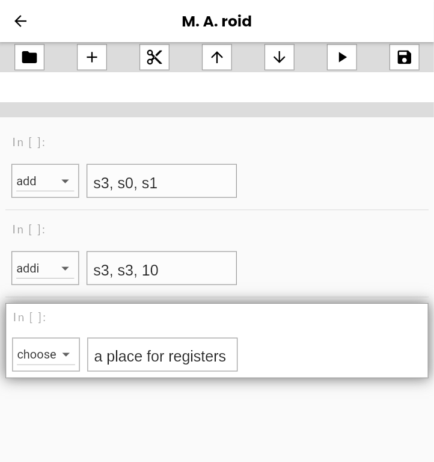
    </td>
    <td>
      <h4>Save</h4>
      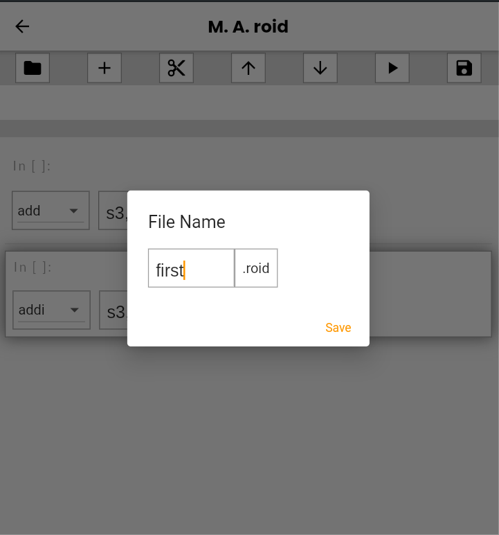
    </td>
    <td>
      <h4>Data Memory</h4>
      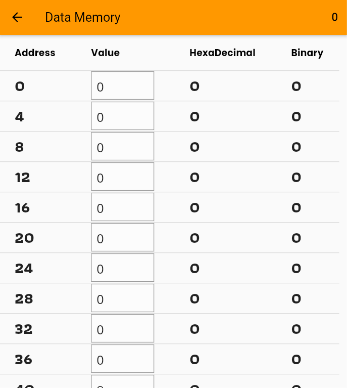
    </td>
  </tr>
</table>

<table>
  <tr>
      <h4>Program</h4>
      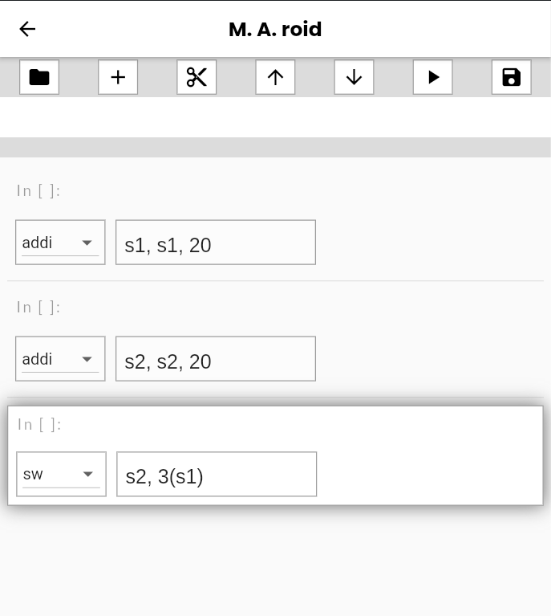
  </tr>
  <tr>
    <td>
      <h4>Execution 1</h4>
      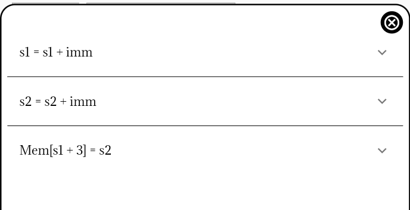
    </td>
    <td>
      <h4>Execution 2</h4>
      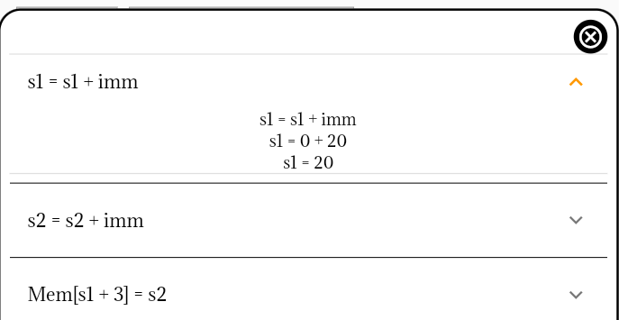
    </td>
  </tr>
  <tr>
    <td>
      <h4>Execution 3</h4>
      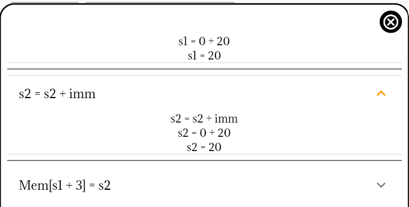
    </td>
    <td>
      <h4>Execution 4</h4>
      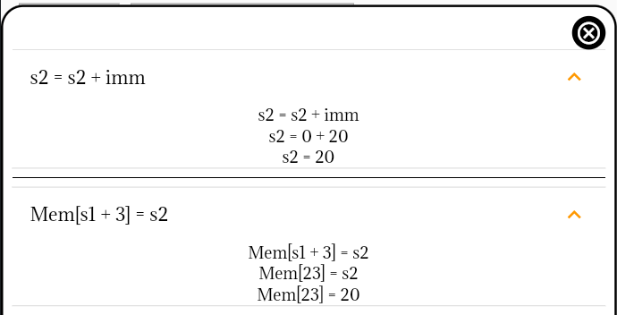
    </td>
  </tr>
</table>

 <a href="https://zapp.run/github/Hassu083/MAROID">
 Link to app
</a>

